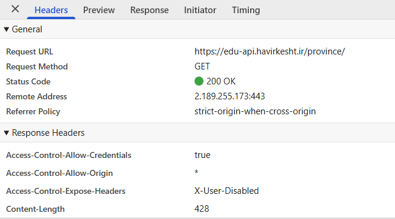
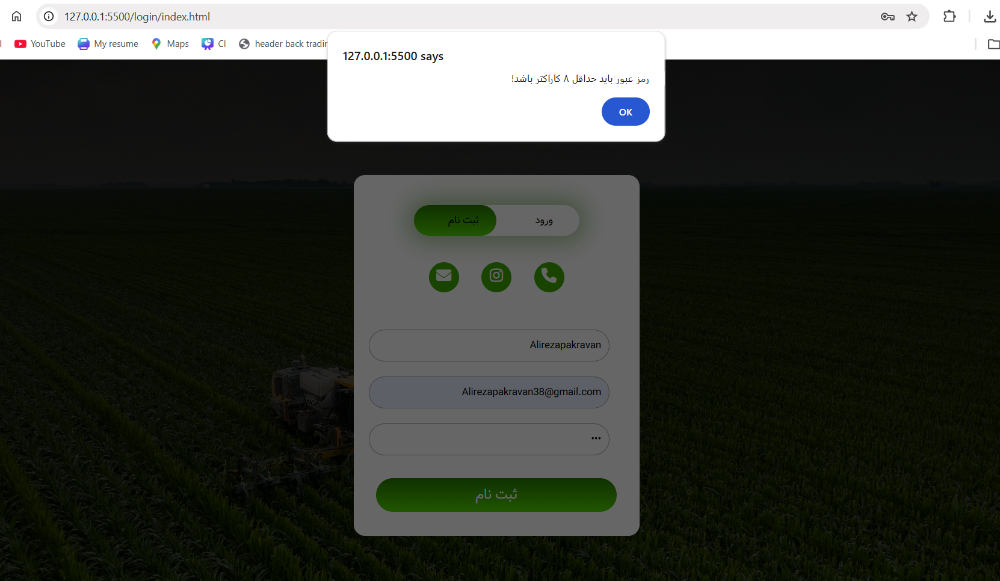
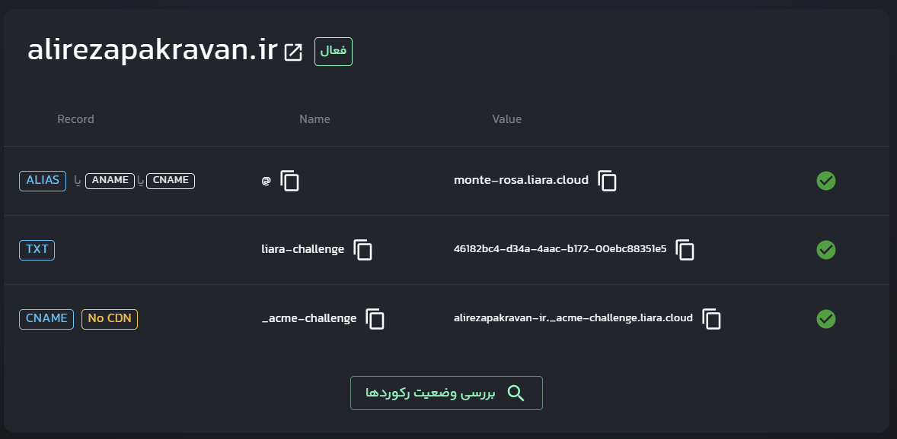
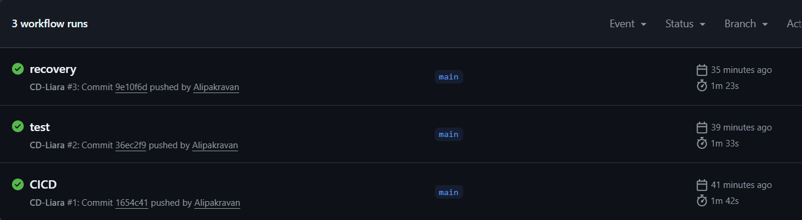

گزارش کامل مراحل اجرای پروژه طراحی وبسایت «هاویرکشت»

این مخزن شامل مستندات، سورس کد و گزارش مراحل طراحی، پیاده‌سازی و استقرار سامانه وب «هاویرکشت» می‌باشد.
در این پروژه تلاش شده است تمامی مراحل از تحلیل و بررسی API ها تا طراحی رابط کاربری، اتصال به بک‌اند، استقرار روی سرور و پیاده‌سازی فرآیند CI/CD به‌صورت کامل و مستند انجام شود.

در ادامه شرح کامل فازهای انجام‌شده در پروژه ارائه شده است:

فاز اول: بررسی، تست و مستندسازی API ها

در اولین مرحله پروژه، تمامی API های ارائه‌شده توسط بک‌اند سامانه هاویرکشت در محیط Swagger مورد بررسی و تست کامل قرار گرفتند.
هدف از این مرحله، شناخت دقیق ساختار درخواست‌ها، پارامترها، متدها و نوع پاسخ‌های دریافتی بود.

اقدامات انجام‌شده در این فاز:

تست کامل API ها در Swagger

بررسی ورودی‌ها و خروجی‌های هر Endpoint

تحلیل Response و Status Code ها

مستندسازی کامل API ها

تهیه فایل مستندات با نام Haavir-BackEnd-doc.pdf

بارگذاری مستندات در مخزن GitHub

نمونه‌ای از مستندات تهیه‌شده:

فاز دوم: تحلیل ارتباط صفحات با API ها از طریق DevTools

در این مرحله، نحوه ارتباط صفحات وب با API های بک‌اند مورد بررسی قرار گرفت.
برای انجام این تحلیل از ابزار Inspect مرورگر استفاده شد.

مراحل انجام کار:

باز کردن صفحات وب

کلیک راست و انتخاب Inspect

ورود به تب Network

فیلتر درخواست‌ها با گزینه Fetch/XHR

بررسی لیست API های فراخوانی‌شده توسط صفحات

با انتخاب هر درخواست موارد زیر بررسی شدند:

آدرس Endpoint

نوع متد (GET / POST / PUT / DELETE)

Header های ارسال‌شده

Payload

Status Code مانند 200 OK

Response دریافتی

نمونه تصاویر تحلیل درخواست‌ها:

در ادامه یک request مشاهده میکنیم که با استفاده از متد GET به آدرس API استان ها ارسال شده است 

و پاسخ 200 به معنای موفق بودن عملیات دریافت شده است.

فاز سوم: طراحی رابط کاربری و اتصال به API ها

در این فاز، رابط کاربری صفحات وب طراحی و سپس به API های بک‌اند متصل شد.

جزئیات فنی:

طراحی صفحات با استفاده از Tailwind CSS

پیاده‌سازی ساختار Responsive

نگهداری کامل سورس کدها در GitHub

اتصال تمامی صفحات به API های سامانه هاویرکشت

استفاده از JavaScript برای ارسال درخواست‌ها، دریافت داده‌ها و نمایش اطلاعات در رابط کاربری

هدف این مرحله ایجاد ارتباط کامل بین Frontend و Backend بوده است.

فاز چهارم: مدیریت و نمایش خطاها

برای افزایش پایداری و تجربه کاربری بهتر، سیستم مدیریت خطا در پروژه پیاده‌سازی شد.

روش‌های نمایش خطا:

استفاده از alert() برای هشدارهای فوری

استفاده از message.innerText برای نمایش پیام در رابط کاربری

انواع خطاهای پوشش داده‌شده:

خطاهای ارتباط با سرور

خطاهای اعتبارسنجی داده

خطاهای پاسخ API

خطاهای منطقی برنامه

در زیر یک خطا که برای رمزعبور کوتاه تر از 8 رقم به صورت alert اطلاع رسانی میشود را مشاهده میکنید

فاز پنجم: تهیه دامنه اختصاصی

در این مرحله یک دامنه اختصاصی برای پروژه تهیه شد:

alirezapakravan.ir

ویژگی‌ها:

ثبت دامنه از طریق ابر آروان

آماده‌سازی برای اتصال به هاست

استفاده به عنوان آدرس رسمی پروژه

فاز ششم: میزبانی پروژه و اتصال DNS

برای استقرار پروژه از سرویس هاستینگ لیارا استفاده شد.

اقدامات انجام‌شده:

آپلود فایل‌های پروژه روی لیارا

تنظیم رکوردهای DNS

اتصال دامنه ابر آروان به هاست لیارا

اطمینان از دسترسی عمومی به پروژه از طریق دامنه

ساختار نهایی:

دامنه: ابر آروان

هاست: لیارا

اتصال از طریق DNS

فاز هفتم: مدیریت نسخه و اتصال پروژه به GitHub

پوشه پروژه «هاویرکشت» به مخزن GitHub متصل شد.

فعالیت‌های انجام‌شده:

ایجاد Repository

اتصال پروژه محلی به GitHub

Push کامل سورس کدها

مدیریت نسخه‌ها

نگهداری تصاویر و مستندات پروژه

اتصال پروژه به گیت هاب و آپلود فایل ها:

فاز هشتم: پیاده‌سازی گواهی امنیتی SSL

برای افزایش امنیت و رمزنگاری ارتباط کاربران با وبسایت:

گواهی SSL از طریق لیارا دریافت شد

وبسایت به پروتکل HTTPS منتقل شد

ارتباطات کاربران رمزنگاری شد

نمونه:

در دسترس بودن از طریق https هم فعال شده است

فاز نهم: پیاده‌سازی فرآیند CI/CD

برای خودکارسازی فرآیند استقرار پروژه، سیستم CI/CD پیاده‌سازی شد.

نحوه عملکرد:

با هر بار اجرای دستور زیر:

git push -u origin main

مراحل زیر انجام می‌شود:

ارسال تغییرات به GitHub

اجرای فرآیند استقرار خودکار

به‌روزرسانی نسخه پروژه روی سرور

اعمال تغییرات روی وبسایت آنلاین

هدف این مرحله:

کاهش خطای انسانی

افزایش سرعت انتشار نسخه‌ها

خودکارسازی Deployment

پس از انجام فرایند لازم که طبق دستورالعمل سایت لیارا برای CICD به آدرس https://docs.liara.ir/paas/cicd/github/
گفته شده، پس از طی همه مراحل CICD را انجام می‌دهیم تا فرایند اجرا خودکار شود

اطلاعات پروژه

این گزارش مربوط به پروژه طراحی وبسایت «هاویرکشت» می‌باشد که توسط:

علیرضا پاکروان

طراحی، پیاده‌سازی و مستندسازی شده است.

تمامی مستندات، تصاویر، کد ها، و گزارش مراحل پروژه در ریپازیتوری Alireza_pakravan و حساب Alipakravan قرار گرفته اند.