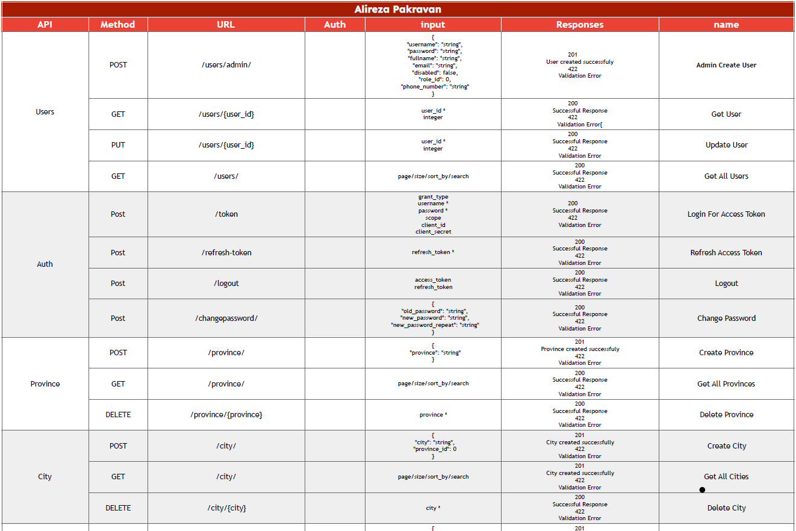
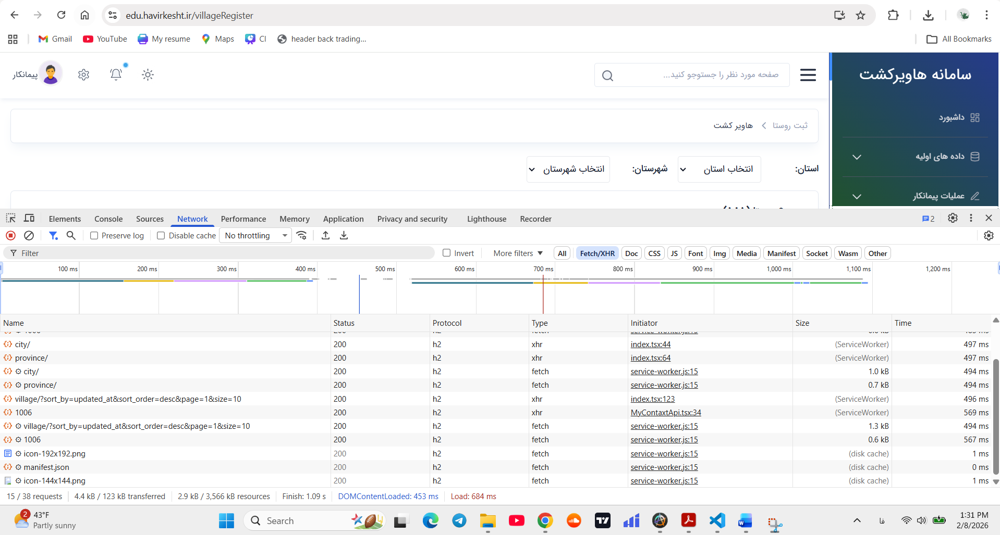
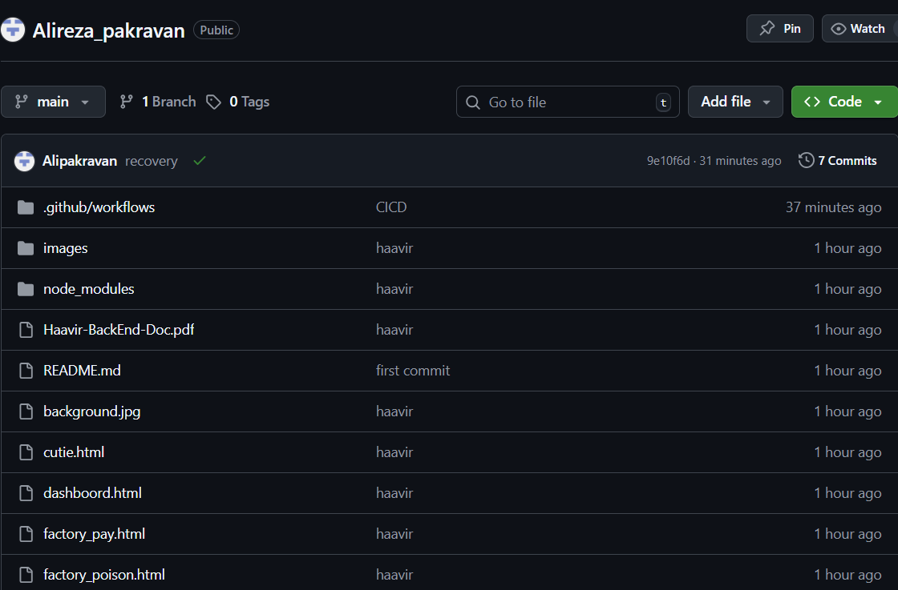
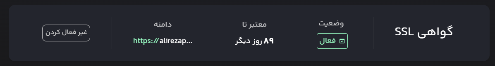

توضیحات پروژه

فاز یکم: لیست تمامی API ها در محیط Swagger تست و مستند سازی شده اند و در قالب فایل haavir-BackEnd-doc.pdf در گیت هاب push شده است
یک نمونه از این API ها:

فاز دوم: برای مشاهده
 API هایی که صفحات فراخوانی میکنند:
ابتدا صفحات را باز میکنیم
با کلیک راست روی inspect کلیک میکنیم
پس از باز شدن این تب روی بخش network کلیک میکنیم
و با انتخاب fetch/XHR آنها را فیلتر میکنیم تا لیست API ها بالا بیایند.

با کلیک بر روی هرکدام، بخش هدر باز خواهد شد که در آن آدرسی که به آن رکوئست زده میشود به همراه 	متد(مثلا GET) و پاسخ برگشتی (مثلا 200 به معنای ok) نمایش داده خواهد شد.

فاز سوم:
صفحات توسط فریم‌ورک Tailwind طراحی شده اند و سورس کد آنها درگیت هاب موجود است.
همچنین تمامی صفحات طراحی شده به API های سامانه هاویرکشت متصل شده اند 
برای فاز بک‌اند و اتصال API ها از زبان Java Script استفاده شده است.

فاز چهارم: 
پوشش خطا ها به دو صورت alert() و message.innertext() نمایش داده میشوند و پوشش خطا ها را با استفاده از این دو نمایش میدهیم

فاز پنجم:
یک دامنه به آدرس alirezapakravan.ir برای خودم از ابر آروان تهیه کردم

فاز ششم:
برای هاست و میزبانی فایل های پروژه از لیارا ساتفاده کردم و فایل های خودم را بر روی آن اپلود کردم و از طریق اتصال DNS به ابر آروان آنها را به یکدیگر متصل کردم 
دامنه از ابر آروان و هاست از لیارا تهیه شده است.

فاز هفتم:
پوشه هاویر کشت که مربوط به پروژه است به گیت هاب متصل شده و فایل های پروژه روی گیت هاب push شده اند

فاز هشتم:
گواهی ssl از طریق لیارا دریافت شده و وبسایت به صورت رمز نگاری شده و با https بالا می آید

فاز نهم:
CICD برای اجرای برنامه ها به محض push شدن کد ها در گیت هاب نیز انجام شده و در صورتی که تغییرات با 
git push -u origin main اجرا شوند بر روی گیت هاب مستقر و در نهایت در سرور قرار خواهند گرفت.

این یک گزارش برای پروژه طراحی وبسایت هاویرکشت است که توسط من (علیرضا پاکروان) انجام شده.
تمامی مستندات در گیت هاب Alipakravan قرار داده خواهند شد.